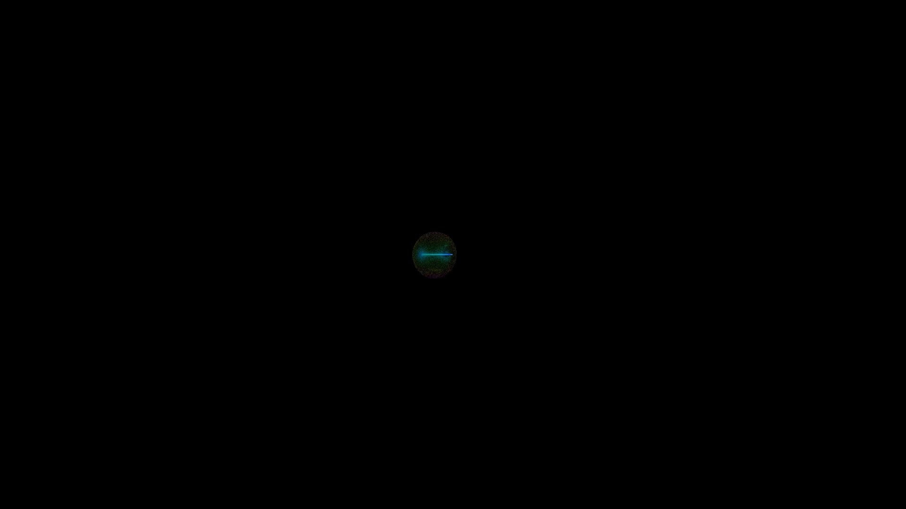

# Chaotic Attractor Cinematic Visualizer

GPU-accelerated cinematic visualization of chaotic attractors using OpenACC. Renders 2 million particles flowing through various attractor systems (Aizawa, Thomas, Lorenz, Halvorsen, Chen) with dynamic camera movement and velocity-based heatmap coloring.

[](https://github.com/leybzon/chaotic-attractors-gpu/raw/main/examples/sample_output.mp4)

*Click image to download sample output video (16MB, 27 seconds)*

## Features

- **GPU Acceleration**: OpenACC directives for NVIDIA GPU parallel processing
- **2M Particles**: Real-time physics simulation of 2 million particles
- **5 Attractors**: Smooth transitions between Aizawa, Thomas, Lorenz, Halvorsen, and Chen attractors
- **Dynamic Camera**: Hybrid zoom system with per-attractor framing, velocity-based adjustments, and optional breathing effects
- **Cinematic Rendering**: Orthographic projection with velocity-based heatmap coloring and depth fade
- **Configurable**: External config file support for fine-tuning zoom, screen fill, and per-attractor parameters
- **1080p 60fps**: Outputs raw RGB frames at 1920×1080 resolution, 60 frames per second

## Requirements

### Hardware
- NVIDIA GPU with OpenACC support
- Tested on ARM64 (aarch64) architecture

### Software
- **NVIDIA HPC SDK** (nvc compiler) - Required for OpenACC compilation
- **FFmpeg** - For encoding raw frames to video
- **ffplay** or **mpv** - For viewing output (optional)

### Installation

#### NVIDIA HPC SDK
```bash
# Download from: https://developer.nvidia.com/hpc-sdk
# Or use package manager (example for Ubuntu):
wget https://developer.download.nvidia.com/hpc-sdk/...
sudo apt install ./nvhpc_*.deb
```

#### FFmpeg
```bash
# Ubuntu/Debian
sudo apt install ffmpeg

# macOS
brew install ffmpeg
```

## Building

Compile with the NVIDIA HPC compiler:

```bash
nvc -acc -fast -Minfo=accel -o attractor_cinematic attractor_cinematic.c -lm
```

**Compiler flags:**
- `-acc` - Enable OpenACC directives
- `-fast` - Aggressive optimizations
- `-Minfo=accel` - Show GPU kernel compilation info
- `-lm` - Link math library

## Usage

### Quick Start (Recommended)

Use the provided shell script for easy video generation:

```bash
# Default: 20 fragments, 300 frames each (100 seconds total)
./generate_video.sh

# Quick test (10 fragments, 60 frames = ~17 seconds)
./generate_video.sh -n 10 -f 60

# Custom output filename
./generate_video.sh -o my_video.mp4

# Use custom config file
./generate_video.sh -c examples/config_3min_production.txt -o output.mp4

# Full options
./generate_video.sh -n 20 -f 300 -c myconfig.txt -o output.mp4 -q 18 -p fast
```

**Script options:**
- `-n <num>` - Number of fragments (default: 20)
- `-f <num>` - Frames per fragment (default: 300)
- `-p <num>` - Particle count (default: 2000000)
- `-c <file>` - Config file path (optional)
- `-s <0-4>` - Starting attractor type (0=Aizawa, 1=Thomas, 2=Lorenz, 3=Halvorsen, 4=Chen)
- `-o <file>` - Output filename (default: cinematic.mp4)
- `-q <num>` - FFmpeg CRF quality, lower=better (default: 18)
- `-p <preset>` - FFmpeg preset: ultrafast, fast, medium, slow (default: fast)
- `-h` - Show help

### Manual Method

Generate frames and pipe directly to FFmpeg:

```bash
./attractor_cinematic -n 20 -f 300 | \
  ffmpeg -f rawvideo -pixel_format rgb24 -video_size 1920x1080 -framerate 60 -i - \
         -c:v libx264 -preset fast -crf 18 -pix_fmt yuv420p -y output.mp4
```

**Program arguments:**
- `-n <fragments>` - Number of attractor fragments (default: 20)
- `-f <frames>` - Frames per fragment (default: 300)
- `-p <particles>` - Particle count (default: 2000000)
- `-c <file>` - Configuration file path (optional)
- `-s <0-4>` - Starting attractor type (default: 0/Aizawa)

**Duration calculation:**
- Total frames = fragments × frames_per_fragment
- Duration (seconds) = total_frames / 60
- Example: 20 fragments × 300 frames = 6000 frames = 100 seconds

**Attractor cycling:**
- Every 6 fragments, the system switches to the next attractor type
- Example with 20 fragments:
  - Fragments 0-5: Aizawa
  - Fragments 6-11: Thomas
  - Fragments 12-17: Lorenz
  - Fragments 18-19: Halvorsen

### Viewing Output

```bash
ffplay output.mp4
# or
mpv output.mp4
```

## Configuration

### Config File Format

Create a text file with key-value pairs to customize zoom and framing:

```bash
# Per-attractor zoom multipliers (controls relative framing)
aizawa=2.0
thomas=1.0
lorenz=2.5
halvorsen=7.5
chen=2.5

# Global zoom parameters
screen_fill_factor=0.35    # Higher = tighter framing (0.1-0.8 recommended)
min_zoom=1.0               # Minimum camera scale (prevents extreme zoom-out)
max_zoom=2000.0            # Maximum camera scale (prevents extreme zoom-in)
initial_cam_scale=100.0    # Starting camera scale (-1 = use default)

# Dynamic effects (0.0 = disabled)
zoom_oscillation=0.0       # Sinusoidal breathing effect amplitude (0.0-0.2)
dynamic_adjustment=0.0     # Velocity-based zoom adjustment (0.0-0.3)
```

### Parameter Details

**Per-Attractor Multipliers:**
Different attractors have vastly different natural scales:
- **Aizawa/Thomas**: Range ±2 units, typically use 0.8-2.0 multiplier
- **Lorenz/Chen**: Range ±20-30 units, typically use 2.0-3.0 multiplier
- **Halvorsen**: Range ±3-5 units, typically use 5.0-10.0 multiplier

Higher multiplier = looser framing (smaller on screen)

**screen_fill_factor:**
Controls what percentage of screen the attractor fills:
- `0.35` (default): 35% screen coverage, cinematic framing
- `0.50`: 50% screen coverage, tighter framing
- `0.70`: 70% screen coverage, very tight framing
- `0.10`: 10% screen coverage, very loose framing

**zoom_oscillation:**
Creates a sinusoidal "breathing" effect:
- `0.0`: Disabled
- `0.12`: ±12% zoom variation per fragment cycle
- Completes one full cycle per fragment duration

**dynamic_adjustment:**
Zooms out during high-velocity particle events:
- `0.0`: Disabled
- `0.15`: Up to ±15% adjustment based on velocity
- Helps keep fast-moving particles on screen

### Example Configs

**Tight Cinematic Framing** (examples/config_3min_production.txt):
```
aizawa=2.0
thomas=1.0
halvorsen=7.5
chen=2.5
screen_fill_factor=0.35
min_zoom=1.0
max_zoom=2000.0
zoom_oscillation=0.0
dynamic_adjustment=0.0
```

**Dynamic Breathing Effect**:
```
screen_fill_factor=0.5
zoom_oscillation=0.15
dynamic_adjustment=0.15
```

## Technical Details

### Architecture

**GPU Parallelization:**
- Persistent GPU memory via `#pragma acc enter data`
- Three main GPU kernels per frame:
  1. **Physics update** (lines 298-349): RK1 (Euler) integration of particle trajectories
  2. **Statistical reduction** (lines 355-377): Center-of-mass and velocity calculations
  3. **Rendering** (lines 417-447): Orthographic projection with atomic RGB accumulation

**Rendering Pipeline:**
1. **Physics**: Compute attractor differential equations, update particle positions/velocities
2. **Camera**: Calculate dynamic zoom based on particle statistics
3. **Projection**: Orthographic projection with Y-axis rotation (theta = frame × 0.005)
4. **Accumulation**: Atomic RGB updates with velocity-based heatmap coloring
5. **Tone Mapping**: Logarithmic exposure compression
6. **Output**: Raw RGB24 frames to stdout

**Attractor Equations:**

*Thomas* (lines 308-309):
```
dx/dt = sin(y) - b·x
dy/dt = sin(z) - b·y
dz/dt = sin(x) - b·z
```

*Lorenz* (lines 310-311):
```
dx/dt = σ·(y - x)
dy/dt = x·(ρ - z) - y
dz/dt = x·y - β·z
```

*Aizawa, Halvorsen, Chen*: See source code for full equations

**Hybrid Camera System:**

The camera uses a three-component multiplier system:

```
combined_multiplier = base_multiplier × dynamic_factor × sinusoidal_factor
target_dimensions = particle_spread × combined_multiplier
camera_scale = (SCREEN_DIMENSION × screen_fill_factor) / target_dimensions
```

1. **Base multiplier**: Per-attractor framing (smoothly interpolated during transitions)
2. **Dynamic factor**: Velocity-based adjustment (zooms out during fast events)
3. **Sinusoidal factor**: Breathing animation (optional)

**Orthographic Projection:**
```c
px = (rotated_x - cam_cx) × cam_scale + WIDTH/2
py = (rotated_y - cam_cy) × cam_scale + HEIGHT/2
```

Direct pixel mapping without perspective division ensures predictable screen filling and consistent framing.

**Particle Reset:**
Out-of-bounds particles (|coordinate| > 80.0) are reset to prevent numerical instability.

**Attractor Blending:**
When switching between attractor types, velocities are smoothly blended over 120 frames (~2 seconds at 60fps) to avoid visual discontinuities.

### Performance

- **2M particles** at **60fps** on NVIDIA GPUs
- Optimized with OpenACC parallel loops and atomic operations
- Real-time rendering with immediate stdout streaming to FFmpeg

## Project Structure

```
.
├── README.md                          # This file
├── CLAUDE.md                          # Claude Code project instructions
├── attractor_cinematic.c              # Main source code
├── generate_video.sh                  # Build and render script
├── examples/
│   ├── sample_output.mp4              # Example output video
│   ├── config_3min_production.txt     # Production config
│   └── attractor_config.example       # Config template
└── .gitignore
```

## Examples

**Generate a 3-minute video with production config:**
```bash
./generate_video.sh -n 36 -f 300 -c examples/config_3min_production.txt -o cinematic_3min.mp4
```

**Quick 10-second test:**
```bash
./generate_video.sh -n 10 -f 60 -o test.mp4
```

**Start with Lorenz attractor:**
```bash
./generate_video.sh -s 2 -o lorenz_start.mp4
```

**High quality encode:**
```bash
./generate_video.sh -q 15 -p slow -o high_quality.mp4
```

## Troubleshooting

**"nvc: command not found"**
- Install NVIDIA HPC SDK
- Add to PATH: `export PATH=/opt/nvidia/hpc_sdk/Linux_aarch64/23.x/compilers/bin:$PATH`

**Black or empty frames:**
- Check config file zoom multipliers (values too high cause extreme zoom-out)
- Try default config first (no `-c` flag)
- Increase `screen_fill_factor` in config (e.g., 0.5 or higher)

**GPU memory errors:**
- Reduce particle count: `-p 1000000`
- Check GPU memory availability

**Slow rendering:**
- Reduce particles: `-p 1000000`
- Use faster FFmpeg preset: `-p ultrafast`

## License

MIT License - see [LICENSE](LICENSE) file for details.

## Contributing

Contributions welcome! Please open an issue or pull request.

## Citation

If you use this code in research or publications, please cite:

**BibTeX:**
```bibtex
@software{leybzon2026chaotic,
  author = {leybzon},
  title = {Chaotic Attractor Cinematic Visualizer},
  year = {2026},
  publisher = {GitHub},
  url = {https://github.com/leybzon/chaotic-attractors-gpu},
  version = {1.0.0}
}
```

**Plain text:**
```
leybzon. (2026). Chaotic Attractor Cinematic Visualizer (Version 1.0.0) [Computer software].
GitHub. https://github.com/leybzon/chaotic-attractors-gpu
```

## Acknowledgments

- Chaotic attractor equations from standard dynamical systems literature
- OpenACC implementation optimized for NVIDIA GPUs
- Rendering inspired by particle flow visualization techniques
